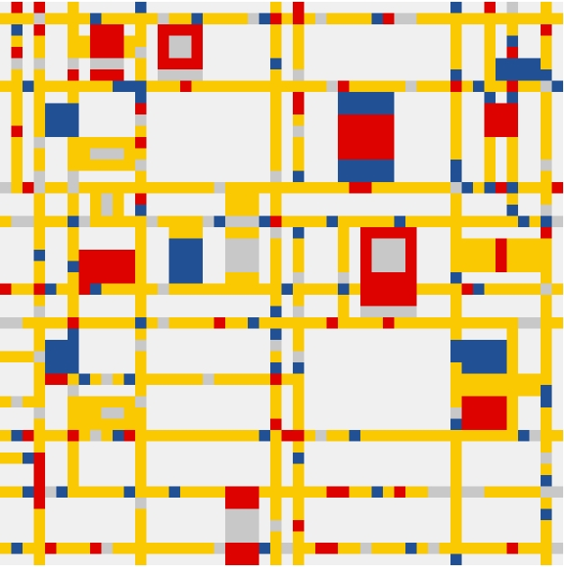

# IDEA9103_wwan8482_FINAL

## **Change Group Code
modify group code, change the approuch to randomize **vehicles (represent red, blue, gray rects )** on yellow routes.(The elements and form of the artwork have not changed much)

## **Let the artwork move logically
Each moving vehicles will re-enter from another canvas entrance after leaving the canvas.

## **Add keyboard key interaction
Press the up/down keys to control the movement speed of the vehicles, and press the space bar to control pause/start.

## **Add quantity change and pause prompts
Set the direction up/down keys to increase/decrease the number of moving vehicles, and the upper right corner displays the numerical value of speed and quantity. After pressing the space bar to pause the screen, you will see a pause prompt button.(This gif has 21 sec, please watch completely)

